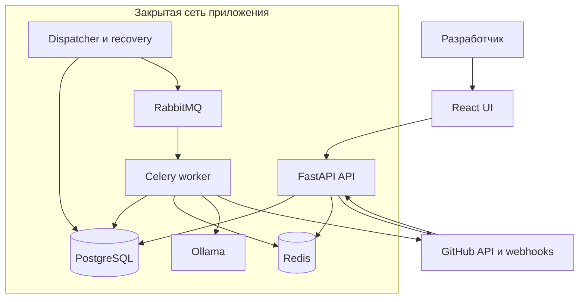
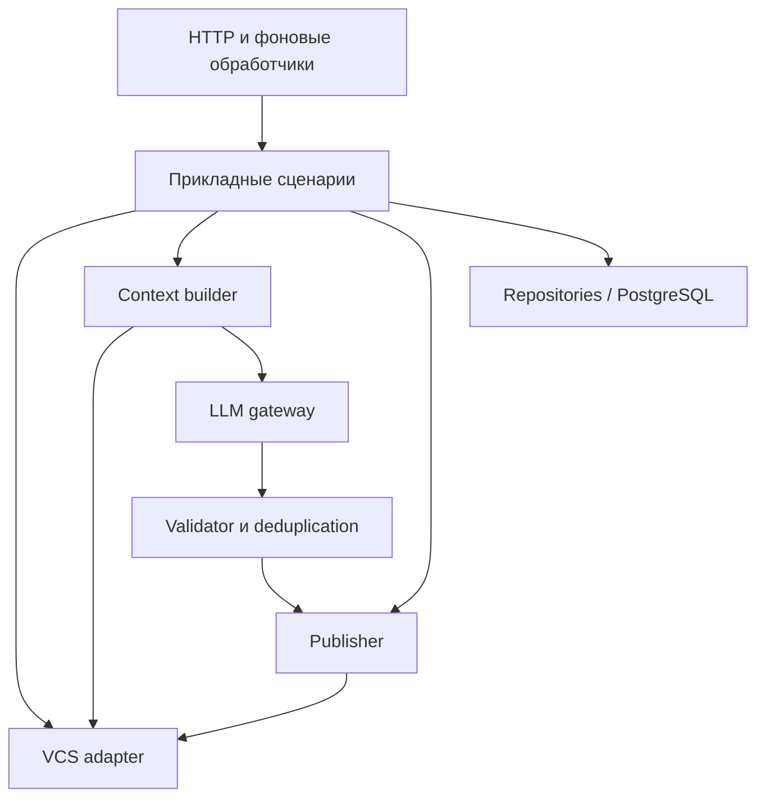

# AI Code Reviewer — System Design

Команда 2 · Larchanka · Tech Lead: Нарек Меликсетян  
Версия: 1.1 · 13 сентября 2026 · Статус: на согласовании команды

## 1. Назначение и статус решений

Документ определяет архитектуру AI-ревьюера и контракты между frontend, backend, фоновыми процессами и LLM. Он задаёт границы реализации; детализация модулей, UI и тестов принадлежит профильным архитектурным документам команды.

Различаются три категории:

- **Требование** — явно следует из задания или зафиксированных материалов команды.
- **Решение v1** — выбранное в этом документе проектное решение для целостного MVP. До утверждения документа это предложение Tech Lead, а не ранее достигнутая договорённость команды.
- **Открытый вопрос** — требует внешнего подтверждения или решения команды; перечислен в разделе 16.

Все конкретные значения лимитов и все сужения MVP ниже относятся к решениям v1, если явно не указано иное. После согласования они становятся контрактом реализации. Наличие документа само по себе не означает выполнения DoD: нужны его размещение в репозитории и утверждение командой.

## 2. Цели, требования и границы

### Подтверждённая основа

Система получает изменения PR/MR из VCS, собирает контекст, выполняет LLM-анализ безопасности, корректности, производительности и поддерживаемости, проверяет ответ и формирует сводку и замечания с привязкой к diff. Контекст строится по четырём уровням: Diff, Surrounding, Whole File, AST / Imports. Нужны ограничения стоимости и размера контекста, обработка повторов, кэширование и понятный статус ревью.

На доске команды обозначены GitHub-бот и желаемый запуск при его назначении ревьюером, проверка доступа/доступного лимита, JWT, RabbitMQ и разделение сетевого доступа. Предложены React/TypeScript, FastAPI/Python, SQLAlchemy/PostgreSQL и Ollama SDK. Redis отмечен как необязательный. Выбор конкретной модели и механизм платной подписки не зафиксированы.

### Граница MVP — решение v1

| Входит | Не входит без отдельного решения |
|---|---|
| GitHub PR; контракт адаптера допускает GitLab | Реализация обеих VCS одновременно |
| Запуск из собственного UI; событие назначения бота — после проверки реализуемости | Автоматический запуск на каждый push, quick actions и произвольные упоминания |
| Проверка доступа и технических квот | Приём платежей, биллинг и покупка токенов |
| Сводка и inline-замечания в PR; просмотр запусков, diff и результатов в UI | Полный аналог интерфейса GitLab, чат с агентом |
| Python и TypeScript/TSX для AST-контекста; остальные текстовые файлы — без гарантий AST | Индексирование всего репозитория, внешний RAG и поддержка всех языков |
| Чтение кода и публикация замечаний | Выполнение кода из PR, изменение ветки, auto-merge и применение исправлений |

Встроенные применяемые suggestions не обязательны для v1: рекомендация текстом допустима. Ревью носит рекомендательный характер, не заменяет тесты, линтеры, SAST и человеческое одобрение. Отсутствие замечаний не является доказательством отсутствия ошибок.

### Текущее состояние реализации на 13 сентября 2026

Архитектура ниже описывает **целевое состояние MVP**, а не утверждает, что все компоненты уже реализованы. Зафиксированный baseline — default-ветки `main`; содержимое открытых PR учитывается при согласовании, но не считается принятой реализацией.

| Область | Уже в `main` | Ещё требуется для целевого MVP |
|---|---|---|
| Backend | Python 3.14, FastAPI, async SQLAlchemy/asyncpg, Alembic baseline, PostgreSQL 18, Redis 8, structlog, Request ID, Docker | Доменные модели, пользовательский API, GitHub App/OAuth/webhook, Celery/RabbitMQ, worker/dispatcher/outbox, Context Builder, Ollama gateway и Publisher |
| Frontend | Минимальный Vite + React + TypeScript | Экран входа, репозитории/PR, запуск и история ревью, progress/coverage, diff и findings, API-клиент и состояние |
| Delivery | API CI, проверки качества, immutable API image в GHCR, ручной staging deploy на существующий VPS | UI image/deploy, reverse proxy и HTTPS, закрытие прямого API-порта, worker/RabbitMQ/Ollama, backup/restore и эксплуатационные метрики |

Backend baseline: [`f7ae81e`](https://github.com/larchanka-training/dmc-268-api-t2/commit/f7ae81e6a510baf53c11bb802f51d04ce12406af). Frontend baseline: [`e222857`](https://github.com/larchanka-training/dmc-268-ui-t2/commit/e22285784c26715f11c22b652baadd9776819c15). После существенных merge этот подраздел обновляется либо заменяется ссылкой на release milestone.

## 3. Архитектура и ответственность компонентов

### Контейнеры и внешние зависимости



API имеет публичный HTTPS-вход через reverse proxy, но БД, брокер и Ollama наружу не выставляются. Статика UI и `/api` обслуживаются с одного origin. GitHub — внешняя система; модель в Ollama работает в контролируемой командой инфраструктуре.

| Компонент | Ответственность | Не делает |
|---|---|---|
| React UI | Список доступных репозиториев/PR, запуск, история, прогресс, diff и замечания | Не хранит VCS/LLM-секреты, не собирает LLM-контекст и не определяет права |
| FastAPI API | Аутентификация, авторизация, webhooks, admission control, пользовательский API | Не выполняет длительное ревью внутри HTTP-запроса |
| Dispatcher / recovery | Доставка outbox, отложенные повторы, восстановление зависших задач, очистка по TTL | Не анализирует код |
| Celery worker | Оркестрация ревью и отдельного этапа публикации | Не считает очередь источником состояния |
| PostgreSQL | Запуски, результаты, права/настройки, outbox, leases, квоты и сохранённый контекст | Не используется как бессрочное хранилище исходников |
| Redis | Rate limiting и горячий TTL-кэш blob/извлечённого контекста | Не хранит задания, результаты, квоты, idempotency records или correctness-critical locks |
| RabbitMQ | Доставка небольших фоновых задач с подтверждениями | Не хранит весь diff, промпт или итоговый результат |
| Ollama | Инференс выбранной модели | Не имеет доступа к VCS, БД и секретам приложения |

API, worker и dispatcher — процессы одного backend-проекта с общей доменной моделью и образом приложения. Логические модули не выделяются в самостоятельные микросервисы. Celery использует RabbitMQ как брокер; отдельный Celery result backend не нужен — состояние находится в PostgreSQL. Redis имеет только ускоряющую/ограничивающую роль и может быть очищен без потери доменного состояния.

### Внутренние компоненты backend



Связи показывают основные передачи данных; порядком вызовов управляет прикладной слой. Repository-слой отвечает только за хранение; он не вызывает LLM. Адаптеры скрывают API провайдеров. LLM gateway владеет шаблонами, сериализацией, лимитами и таймаутами, но не принимает решение о публикации. Context builder детерминированно собирает ограниченный контекст; автономный цикл произвольных tool calls модели в v1 не нужен.

## 4. Основные сценарии и жизненный цикл

### Запуск и анализ

```mermaid
sequenceDiagram
    participant Source as UI / webhook
    participant API as API
    participant DB as PostgreSQL
    participant Worker as Dispatcher / worker
    participant Ext as GitHub / Ollama
    Source->>API: Запрос ревью
    API->>API: Подлинность, доступ, квота, дедупликация
    API->>DB: Транзакция: ReviewJob + OutboxEvent
    API-->>Source: Принято; review_id для UI
    Worker->>DB: Outbox → доставка; захват задачи
    Worker->>Ext: Снимок PR и контекст по SHA
    Worker->>Ext: Ограниченные вызовы модели
    Worker->>DB: Проверенные результаты и покрытие
    Worker->>DB: Outbox публикации
    Worker->>Ext: Проверка актуальности; публикация
    Worker->>DB: Итог публикации
    Source->>API: Получить статус и результаты
```

1. API принимает ручной запуск либо разрешённое событие webhook. Создание задания и резервирование квоты атомарны. Для быстрого приёма webhook достаточно подписи, локально разрешённого инициатора/репозитория и квоты; проверка текущих VCS-прав выполняется worker до чтения кода. HTTP-обработчик не ждёт модель.
2. Worker подтверждает доступ, получает PR и фиксирует снимок. Если указанный при запуске head SHA уже неактуален, задание завершается как `SKIPPED / obsolete`; незаметная подмена новым коммитом запрещена.
3. Сборщик получает diff, фильтрует файлы, строит четыре уровня контекста и чанки. Для каждого пропуска сохраняется причина и затронутый диапазон/файл.
4. Gateway вызывает модель. Валидатор проверяет формат и координаты, удаляет дубли. Результаты успешно обработанных чанков сохраняются независимо от последующих ошибок.
5. Итог анализа, статус публикации `PENDING` и её outbox-событие записываются одной транзакцией. Ошибка публикации не заставляет повторять инференс.
6. UI показывает прогресс из БД и различает результат анализа, неполное покрытие и состояние публикации.

### Состояния

`ReviewJob.status`: `QUEUED → RUNNING → COMPLETED | PARTIAL | FAILED | SKIPPED`; истечение срока ожидания также допускает `QUEUED → SKIPPED`.

- `COMPLETED` — обработаны все допущенные политикой изменения в рамках согласованного scope; число замечаний может быть нулевым.
- `PARTIAL` — получен полезный результат, но часть допущенных изменений не рассмотрена из-за бюджета, недоступного контекста или ошибки чанка. Все ограничения видны пользователю.
- `FAILED` — анализ не дал пригодного результата или отсутствует обязательный diff/снимок.
- `SKIPPED` — ревью не выполнялось: устаревший/закрытый PR, нет подходящих изменений либо истёк срок ожидания. Причина обязательна.

Фильтрация бинарных/сгенерированных файлов по политике не делает запуск `PARTIAL`, но отражается в покрытии. Недостаточная поддержка языка AST указывается отдельно; отсутствие необязательного уровня 4 не означает отказ всего запуска.

`stage`: `snapshot`, `context`, `inference`, `validation`, `done`; прогресс — число завершённых/плановых чанков, а не выдуманный процент качества. Повторяемая ошибка оставляет запуск `RUNNING` с `retry_at`; итоговое состояние устанавливается после исчерпания повторов/дедлайна.

`publication_status` независим: `NOT_READY`, `PENDING`, `PUBLISHED`, `PARTIAL`, `FAILED`, `UNKNOWN`, `SKIPPED`. Анализ может быть `COMPLETED`, а публикация — `FAILED`. Результаты `PARTIAL` публикуются только со столь же явной пометкой неполноты; для `FAILED/SKIPPED` комментарии не создаются.

Повтор доставки задачи продолжает тот же запуск. Явное «Повторить ревью» создаёт новый запуск с `rerun_of`; автоматическое переоткрытие terminal-состояния не допускается. Новый push сам по себе не запускает анализ в предлагаемой v1.

## 5. VCS-интеграция и неизменяемый снимок

GitHub подключается через GitHub App с доступом только к выбранным репозиториям: чтение metadata/contents и чтение/запись pull requests. Вход — `POST /api/v1/webhooks/github`; webhook проверяется по подписи исходного тела, GitHub delivery ID используется для технической дедупликации. Принятые и повторные события получают 2xx; неизвестные события подтверждаются без создания задач. Назначение ревьюера соответствует событию `pull_request` / `review_requested`, но возможность назначения именно нашего бота должна быть проверена отдельно: наличие установки GitHub App этого не гарантирует. См. [события GitHub](https://docs.github.com/en/webhooks/webhook-events-and-payloads#pull_request).

| Операция адаптера | Вход | Выход / гарантия |
|---|---|---|
| Получить PR | repository_id, номер PR | Статус, title/body, author, source/base repositories и refs, head/base SHA |
| Получить снимок diff | PR и зафиксированные SHA | Список файлов, hunks и line map; признак полноты |
| Прочитать blob / дерево | repository_id, commit SHA, путь | Содержимое/метаданные именно этой версии; лимит размера |
| Получить обсуждения | PR, пагинация | ID, автор, body, координаты, commit при наличии |
| Опубликовать review | Снимок, сводка, валидные замечания, marker | Remote review/comment IDs либо типизированная ошибка |
| Сверить публикацию | PR и marker | Найденные объекты либо неопределённый результат |

`Snapshot` содержит `base_repository_id`, `head_repository_id`, `base_sha` (вершина target), `merge_base_sha` (общий предок), `head_sha`, `captured_at`. Ревью рассматривает изменения `merge_base_sha…head_sha`. Старое содержимое берётся по merge-base, новое — по head; для fork учитывается отдельный source repository. Читаются только явно доступные установке репозитории. Отсутствующий доступ — явная ошибка, а не повод читать другую ветку.

Пагинация обязательна. Отсутствующий/обрезанный provider patch не трактуется как пустой diff: адаптер восстанавливает его из blob фиксированных версий в пределах лимитов или возвращает неполноту. Если API diff опирается на текущее состояние PR, SHA проверяются до и после чтения; при изменении снимок не принимается. Во время повтора зафиксированный снимок не меняется. Все чтения кода идут по SHA, не по `HEAD`/имени ветки.

Перед публикацией проверяются актуальные head и base SHA, открытое состояние PR, доступ приложения и сохранение прав инициатора. Устаревший результат остаётся в истории, но не публикуется. Изменение PR непосредственно после проверки полностью исключить нельзя: review дополнительно привязывается к `commit_id = head_sha`, и сводка явно называет снимок.

## 6. Сборщик контекста

### Общий контракт

`ContextPayload` — версионированный пакет одного чанка: `schema_version`, `review_id`, `chunk_id`, `snapshot`, `metadata`, `files`, `related_symbols`, `coverage`, `budget`. Все диапазоны включительные, номера строк начинаются с 1; отсутствующая старая/новая сторона обозначается `null`, а не нулём. Пути нормализуются относительно корня репозитория.

`metadata`: title/body PR, названия веток, сообщения коммитов в пределах бюджета, языки, релевантные существующие обсуждения, применённые правила и их версия. Текст PR и кода — данные, а не инструкции для агента. `coverage` содержит включённые/пропущенные файлы и диапазоны, причины, качество извлечения контекста; `budget` — оценку входных токенов и резерв ответа.

| Уровень | Структура данных | Получение и правила |
|---|---|---|
| 1. Diff | `FileDiff`: old/new path, статус файла, old/new blob SHA, язык, hunks. `Hunk`: old/new start и count; строки с kind `added/deleted/context`, text, old_line/new_line | Обязательное ядро. Сохраняется точное соответствие строк оригинальному diff. Переименование и удаление не маскируются под обычное изменение |
| 2. Surrounding | `SourceWindow`: path, side, commit SHA, start/end line, text, covered_hunk_ids | По 30 строк вокруг изменений; пересечения объединяются. Если AST доступен, предпочтительно тело затронутой функции в пределах бюджета |
| 3. Whole File | `FileContext`: path, side, commit SHA, text, changed_ranges | Новый файл целиком при размере до 300 строк и достаточном бюджете; для полностью удалённого — старая версия. Заменяет дублирующиеся окна, но не line map уровня 1 |
| 4. AST / Imports | `RelatedSymbol`: qualified_name, kind, signature, path, commit SHA, range, import/reference, relation_to_change; небольшой source excerpt при необходимости | Из импортов и ссылок затронутых функций; глубина 1, до 20 символов из не более 10 связанных файлов на запуск. Не весь dependency graph |

AST-парсер (решение v1: Tree-sitter для Python и TypeScript/TSX) находит синтаксические узлы, но сам по себе не разрешает импорты. Отдельный resolver поддерживает локальные Python-модули и относительные TS-импорты. Неразрешённые alias, динамические импорты и внешние библиотеки помечаются `unresolved`; сигнатуры для них не выдумываются. Расширение на TS path aliases/сложные monorepo — отдельная задача после базового контура.

### Отбор и budgeting

1. Исключить бинарные, generated/minified и lock-файлы по централизованной политике; применить проектные ignore-globs. В v1 правила/исключения хранятся в настройках репозитория, версионируются и изменяются только уполномоченным оператором. Формат `.gitlab/duo-ignore` не считается подтверждённым стандартом или обязательным интерфейсом нашего проекта.
2. Приоритет — изменённый исполняемый код, затем конфигурация, затем документация. Изменения конфигурации не считаются безопасными по умолчанию.
3. Чанк строится по файлу/функции; слишком большой блок разбивается по hunks, а слишком большой hunk — на последовательные диапазоны строк с сохранением исходной line map. Один изменённый диапазон имеет один основной чанк; контекст может повторяться.
4. Сначала резервируются системные инструкции, diff, локальный контекст и ответ модели. Затем добавляются whole-file и связанные символы по релевантности. Дублирующийся текст уровней 2–4 удаляется.
5. При нехватке бюджета сначала убирается низкоприоритетный дополнительный контекст, затем изменения переносятся в следующий чанк. Превышение общего лимита означает явное неполное покрытие, а не скрытое усечение.

Все метаданные, правила, сообщения и диалоги входят в общий токен-бюджет. Если точный токенизатор модели недоступен, используется консервативная оценка с запасом; переполнение контекста провайдера приводит к уменьшению/пересборке чанка в том же общем бюджете, не к бесконечному повтору.

### Кэш

В v1 используется двухуровневое хранение. Redis — горячий TTL-кэш загруженных blob и производного контекста; PostgreSQL хранит зафиксированный `ContextPayload` активного/завершённого запуска в пределах retention и остаётся источником истины. Redis не использует постоянство данных и не является Celery result backend.

Ключ blob: provider + installation/repository ID + commit SHA + path. Ключ извлечённого контекста дополнительно включает версию builder/parser, параметры окон и набор затронутых диапазонов. Ключ итогового пакета включает оба снимка репозиториев, rules_version и хеш изменяемых метаданных/обсуждений. Значение содержит schema version, payload, размер и expiry; отрицательные ответы VCS не кэшируются дольше одной минуты.

Исходный код разных репозиториев/установок не смешивается. Авторизация проверяется и при cache hit. Изменение SHA, правил или алгоритма даёт новый ключ; истечение TTL удаляет запись. LLM-ответы не переиспользуются как «новое ревью»; сохранённый результат чанка нужен только для продолжения того же запуска. Для Redis задаются memory limit, eviction policy и TTL, поэтому очистка кэша является штатной. При недоступном Redis новые review-запросы закрываются с 503, чтобы rate limit нельзя было обойти; чтение уже сохранённых результатов продолжает работать через PostgreSQL.

## 7. Контракт LLM и проверка результата

Gateway принимает `ContextPayload`, идентификатор/версию модели, `prompt_version`, настройки генерации и максимальный размер ответа. Возвращает структурированный `ReviewChunkResult`: `schema_version`, `chunk_id`, краткую сводку, список `findings`, предупреждения об ограничениях и доступные usage/latency. Провайдерский raw response не передаётся напрямую frontend.

| Поле Finding от модели | Контракт |
|---|---|
| location | path, side `OLD/NEW`, line; необязательный end_line на той же стороне |
| category | `security`, `correctness`, `performance`, `maintainability` |
| severity | `critical`, `high`, `medium`, `low`; приоритет замечания, не автоматический запрет merge. `info` не является finding v1 |
| title / explanation | Краткая проблема, условия проявления и последствия |
| evidence | Ссылка на строку/символ из переданного контекста и обоснование |
| recommendation | Конкретное предложение разработчику; без автоматического применения |

Валидатор проверяет схему, допустимые значения, размер полей, принадлежность пути снимку и точное попадание координат в изменённые строки. Для добавления используется новая сторона; для удаления — старая. Диапазон не переносится на соседнюю строку «по догадке». Если адаптер не может опубликовать корректное inline-замечание, оно остаётся в UI/сводке с явным указанием местоположения.

Замечания с неподтверждаемой координатой или несвязанным evidence исключаются. Точные дубли между чанками объединяются по нормализованным path/side/range/category и тексту проблемы; близкие по смыслу замечания не сливаются автоматически без надёжного критерия. Стилевые предпочтения и то, что уже покрывает форматтер, исключаются правилами промпта и фильтром. Проверка структуры и повторный LLM-анализ не доказывают истинность замечания; precision/false positives оцениваются отдельно QA.

При невалидном ответе разрешён один запрос исправления формата на запуск в общем бюджете. Неполучившийся чанк помечается ошибкой, остальные результаты сохраняются. Итоговая сводка собирается приложением из сводок чанков, severity counts и coverage; дополнительный обязательный LLM-вызов для неё не нужен. Идентификаторы findings, fingerprints и lifecycle назначает backend, не модель.

## 8. Публикация, повторы и актуальность

Решение v1: один GitHub review на запуск с `event = COMMENT`, общей сводкой и максимум 20 inline-замечаниями, отсортированными по severity и стабильному местоположению. Остальные проверенные findings доступны в UI; сводка сообщает об ограничении публикации. Сводка содержит head SHA, полноту покрытия, ограничения, ссылку на запуск и стабильный marker `review_id`. Бот не выставляет `APPROVE` или `REQUEST_CHANGES`. Используется явный `commit_id`; правила координат и права сверяются с [GitHub Pull request reviews API](https://docs.github.com/en/rest/pulls/reviews).

Перед отправкой Publisher резервирует lease для конкретного PR, проверяет актуальность снимка и ищет уже созданный review по marker и автору-приложению. Remote IDs сохраняются. Повтор публикации не создаёт новый `ReviewJob` и не вызывает модель. Публикация другого запуска не редактирует сводку старого: история остаётся привязанной к своему снимку.

Внешний API не даёт общей транзакции с нашей БД, поэтому end-to-end «exactly once» не обещается. При timeout после отправки запрос считается неопределённым: сначала сверяются удалённые review/comments. Если отсутствие результата нельзя установить надёжно, статус `UNKNOWN`, автоматическая повторная отправка останавливается до сверки оператором. Если обнаружен лишь частично опубликованный review, статус `PARTIAL`: оператор сверяет результат, автоматическое достраивание такого review в v1 не выполняется. Повтор разрешён только при подтверждённом отсутствии всей публикации.

Уже опубликованные ботом замечания на том же снимке с тем же fingerprint не отправляются повторно; сводка нового ручного запуска может ссылаться на существующие комментарии. Комментарии людей не удаляются и не изменяются. Отсутствие finding в следующем ревью не означает `FIXED`: модель недетерминирована, а покрытие может отличаться. Автоматического жизненного цикла исправления находок в v1 нет.

## 9. Очередь, идемпотентность и восстановление

| Механизм | Контракт |
|---|---|
| Webhook dedup | Уникальность provider + delivery_id; проверка подписи до обработки |
| Ручной запуск | Обязательный `Idempotency-Key`; ключ в области пользователя и операции, request hash, TTL 24 часа. Повтор того же тела возвращает прежний review_id; другое тело с тем же ключом — 409 |
| Бизнес-дедупликация | Не более одного активного запуска repository + PR + requested head SHA + config version. Новый ключ клиента не обходит это ограничение |
| Outbox | Создание задания/резервирование квоты и событие в одной транзакции PostgreSQL; запись удаляется/закрывается только после подтверждённой доставки |
| Сообщение очереди | schema_version, event_id, review_id, task_kind `analyze/publish`, attempt, trace_id. Без токенов, исходников, промптов и сериализованных Python-объектов |
| Worker lease | Атомарный захват по review_id/task_kind, owner, expiry и возрастающий fencing token. Запись результатов принимается только от актуального владельца |

Dispatcher читает pending outbox с блокировкой выбранных строк, публикует persistent messages в durable RabbitMQ queues с publisher confirms. Падение после отправки, но до отметки в БД создаёт допустимый повтор. Worker проверяет состояние соответствующего этапа и lease: завершённый анализ не отменяет ожидающую публикацию. Повторная доставка не порождает второй анализ. Потеря сообщения после принятия брокером обнаруживается recovery по отсутствию живого lease/прогресса и приводит к новой outbox-доставке.

Используются очереди `review.analyze`, `review.publish` и карантин `review.dead`. Отдельная публикационная очередь позволяет не ждать медленного инференса. Поздний ack выполняется после сохранения результата или устойчивого решения о повторе. Поведение при гибели worker настраивается явно; один `acks_late` не гарантирует все сценарии redelivery — см. [Celery tasks](https://docs.celeryq.dev/en/stable/userguide/tasks.html).

Единственный владелец политики retry — прикладной слой и dispatcher: попытки и `retry_at` хранятся в БД. Celery autoretry поверх этого не используется. Recovery раз в 30 секунд проверяет просроченные leases, недоставленные события и дедлайны. Heartbeat — каждые 15 секунд, lease — 90 секунд; они обновляются независимо от ожидания LLM. После потери lease worker не сохраняет результаты и не начинает внешние записи.

До трёх попыток на этап для временных ошибок, с backoff/jitter и учётом `Retry-After`; бюджет и дедлайн запуска имеют приоритет. Невалидное сообщение или окончательно неуспешная задача направляется в карантин явной логикой приложения; не предполагается, что Celery автоматически переносит любой exception в RabbitMQ DLQ. Повтор из карантина — действие оператора после выяснения причины.

Глобальная параллельность инференса начинается с 1. Долговременная квота и лимит активных работ атомарно резервируются в PostgreSQL; Redis хранит только короткие rate-limit counters для защиты HTTP/webhook-входа. Увеличение числа API/worker не обходит ограничения. Внешний вызов нельзя откатить fencing token: после потери lease публикация всё равно требует сверки удалённого результата по разделу 8.

## 10. Данные и хранение

| Сущность | Основные данные / связи |
|---|---|
| User / RepositoryAccess | GitHub user ID; разрешённые repository IDs и роль `viewer/reviewer/admin`. Не заменяют проверку доступа пользователя в GitHub |
| Repository | provider, external ID, installation ID, владелец/имя, enabled, настройки правил/ignore/квот и их версия |
| ChangeRequest | repository_id + внешний номер (unique), source/base repositories, title, последний известный статус и SHA; это изменяемая карточка, не снимок ревью |
| ReviewJob | change_request_id, initiator/trigger, requested SHA, Snapshot, config/prompt/model versions, rerun_of, status/stage, timestamps, deadline, coverage, usage, error, publication_status |
| ContextPayload / ChunkResult | review_id + chunk_id (unique), schema/builder versions, пакет контекста, статус чанка, summary, usage и ошибка |
| ReviewEvent | review_id, timestamp, stage, event_type и безопасные детали перехода для журнала UI |
| Finding | review_id/chunk_id, проверенные location/category/severity/evidence/recommendation, fingerprint |
| Publication | review_id, payload hash, marker, remote IDs по объектам, status, attempt, error; связь с Finding для inline-комментариев |
| OutboxEvent / TaskLease | Доставка, due_at/attempt; owner/expiry/fencing token для задачи и публикации PR |
| WebhookReceipt / IdempotencyRecord | Внешний delivery ID либо клиентский ключ, request hash и review_id |
| QuotaUsage | Атомарные резервы и счётчики использованного лимита в PostgreSQL |

Источник истины — PostgreSQL; JSONB подходит для версионированного контекста, coverage и provider metadata, но идентификаторы, состояния, ограничения уникальности и связи остаются отдельными полями. Миграции выполняются Alembic. Настройки и версии фиксируются при создании запуска; worker не подхватывает обновлённые правила или промпт посреди работы. Метаданные PR и обсуждения сохраняются при сборке контекста, повтор использует сохранённый пакет. Квота резервируется один раз на запуск, retry не создаёт новый резерв; возврат неиспользованного резерва тоже идемпотентен. Отдельный денежный баланс в модели v1 отсутствует.

Решение v1 по retention: Redis-кэш — до 24 часов и до 1 GiB на инстанс; исходники/ContextPayload в PostgreSQL — 7 суток; результаты, фрагменты evidence и события запусков — 30 суток. После удаления контекста UI продолжает показывать метаданные и findings, но честно сообщает, что сохранённый diff больше недоступен. Redis и исходники не включаются в долговременные backup; срок резервных копий результатов — до 7 суток. Значения требуют согласования с владельцами репозиториев. Удаление локальных результатов не удаляет комментарии в GitHub.

## 11. Контракт frontend ↔ backend

HTTP JSON API с префиксом `/api/v1`; OpenAPI — источник типов и форматов. Все ресурсы принадлежат репозиторию, а сервер проверяет доступ на каждом запросе. Предлагаемый UI: выбор репозитория/PR → запуск → список запусков → детали с покрытием, findings и статусом публикации. Он не обязан повторять навигацию GitLab.

| Метод и маршрут | Назначение / результат |
|---|---|
| GET `/auth/github/start`, GET `/auth/github/callback` | Начало входа и серверный OAuth callback; после проверки — cookie с JWT и redirect в UI |
| POST `/auth/logout` | Завершение пользовательской сессии, удаление cookie |
| GET `/me` | Пользователь, разрешённые действия |
| GET `/repositories` | Только доступные подключённые репозитории |
| GET `/repositories/{id}/pull-requests` | Доступные PR с текущими SHA и статусом |
| POST `/repositories/{id}/pull-requests/{number}/reviews` | requested_head_sha, optional rerun_of; заголовок Idempotency-Key. Новый запуск — 202 + review_id/status URL; повтор — прежний ресурс |
| GET `/repositories/{id}/reviews` | История запусков, фильтры по PR/статусу |
| GET `/reviews/{id}` | Снимок, stage/status, chunk counts, summary, coverage, usage, timestamps, publication_status, безопасная ошибка |
| GET `/reviews/{id}/findings` | Проверенные findings, координаты и publication references |
| GET `/reviews/{id}/diff` | Сохранённые hunks/line map снимка, без LLM-промпта; 410 после истечения retention |
| GET `/reviews/{id}/events` | Краткие события этапов для журнала UI; не chain-of-thought модели |
| POST `/reviews/{id}/publication-retries` | Idempotency-Key; новый цикл публикации только для FAILED с подтверждённым отсутствием remote review. Для UNKNOWN, PARTIAL или устаревшего снимка — 409 |

Списки используют cursor pagination, limit по умолчанию 20, максимум 100. Время — UTC ISO 8601; внутренние ID — непрозрачные строки. Ошибка содержит `code`, безопасное `message`, `request_id`, `retryable` и при необходимости `retry_after`; stack trace/секреты не возвращаются. 401 — нет сессии; 403 — нет разрешения; 404 — ресурс недоступен/не существует; 409 — конфликт версии/состояния; 422 — невалидный ввод; 429 — квота; 503 — временно недоступен обязательный компонент при приёме запроса.

UI опрашивает активный запуск раз в 3 секунды, увеличивает интервал до 15 секунд при длительном ожидании/ошибках, приостанавливает опрос в неактивной вкладке. Опрос прекращается, когда анализ terminal и публикация не `PENDING/NOT_READY`. Для `FAILED/SKIPPED` анализа публикация сразу `SKIPPED`. WebSocket/SSE в v1 не требуются. Состояния «нет замечаний», «неполное ревью» и «публикация не удалась» визуально различаются.

## 12. Безопасность и доступ

- **Идентификация — решение v1:** GitHub OAuth web flow через backend, затем короткоживущий JWT в `Secure`, `HttpOnly`, `SameSite=Lax` cookie; 30 минут, без refresh-механизма в MVP. JWT не хранится в localStorage. OAuth state проверяется, все изменяющие пользовательские запросы защищены от CSRF и проверкой Origin.
- **Авторизация:** локальный доступ к репозиторию задаётся оператором; дополнительно подтверждается текущий read-доступ пользователя к нему в GitHub, с кэшем не дольше 60 секунд. Запуск/повтор требует роли reviewer, изменение конфигурации — admin. При невозможности подтвердить права доступ закрывается. Технические детали выбранного OAuth-приложения должны поддерживать эту проверку; пользовательский токен хранится только зашифрованным на backend.
- **Бот и пользователь — разные субъекты:** installation token используется для фоновой работы, не передаётся UI и не даёт любому вошедшему пользователю доступ ко всем установленным репозиториям. Webhook инициирует ревью только для включённого репозитория и разрешённого инициатора; внутренний actor ID фиксируется. После отзыва установки новые обращения блокируются, активные публикации прекращаются.
- **Секреты:** private key GitHub App, OAuth client secret, webhook secret и JWT key передаются через секреты окружения/deployment, не коммитятся. Логи, task messages и ошибки их не содержат. Права GitHub App минимальны; токены и ключи ротируются.
- **Недоверенный код:** исходники, описание PR, комментарии и строки правил из PR не могут менять системные инструкции. Настройки проекта берутся из доверенной конфигурации, не из предложенной PR правки. Модель не получает shell, произвольную сеть или VCS-инструменты. Код не исполняется, зависимости PR не устанавливаются.
- **Вывод модели:** разрешены только структурированные findings; текст экранируется в UI, HTML не исполняется, ссылки обрабатываются безопасно. Путь не может выйти за репозиторий. Нельзя публиковать найденное значение секрета целиком — только тип, местоположение и маскированный фрагмент.
- **Приватность:** локальный Ollama не означает автоматически zero retention. Сроки хранения приложения и резервных копий заданы отдельно; request-body logging модели отключён. Внешний LLM-провайдер без отдельного согласования владельцев кода не подключается.

## 13. Ошибки и наблюдаемость

| Ситуация | Поведение |
|---|---|
| Неверная подпись / нет локального разрешения | Отклонить до создания задания; security event без тела запроса. Отзыв VCS-прав, обнаруженный worker, завершает анализ ошибкой доступа |
| БД недоступна при admission | Не подтверждать принятие задачи; 503, безопасный повтор источником |
| Redis недоступен | Не принимать новые запуски: 503 и fail-closed rate limit; чтение результатов из PostgreSQL доступно. После восстановления кэш наполняется заново |
| Брокер недоступен | Уже созданная задача остаётся QUEUED в БД/outbox; dispatcher повторяет доставку |
| VCS rate limit / 5xx / сеть | Retry-After/backoff в пределах дедлайна; отдельные лимиты на установку |
| VCS 401/403, удалённый PR или blob | Проверить тип причины: rate limit повторяем; отозванный доступ — нет. Не подставлять пустой контекст |
| Ошибка AST или связанного файла | Продолжить с доступными уровнями, сохранить ограничение; обязательный diff должен оставаться достоверным |
| LLM timeout / неверный формат | Ограниченные повторы/исправление по общему бюджету; сохранить готовые чанки |
| Worker завершился | Lease истекает; recovery возобновляет незавершённые чанки того же снимка |
| PR обновился / закрылся | Не публиковать устаревшее ревью; результаты доступны в истории |
| Неопределённый результат записи в VCS | UNKNOWN, сверка remote IDs/marker, без слепой повторной публикации |

Структурированные логи содержат timestamp, level, component, request/trace ID, review_id, stage, attempt, duration и безопасный error_code. Уже реализованный HTTP-контракт использует `X-Request-Id`; тот же ID передаётся в outbox/task как `trace_id`. Сохраняются переходы состояний, cache hit/miss, число файлов/чанков/токенов, retries и результат публикации. Не сохраняются raw prompts, исходники и внутренние рассуждения модели в operational logs.

Минимальные измерения: webhook/API latency, возраст очереди/outbox, длительность этапов и полного анализа, доля FAILED/PARTIAL, ошибки VCS/LLM, usage, объём кэша и UNKNOWN-публикации. `GET /healthcheck` — уже реализованный liveness без обращений к зависимостям. `GET /readiness` предстоит реализовать: PostgreSQL обязателен, Redis/RabbitMQ/Ollama возвращаются как статусы возможностей. При недоступном Redis API остаётся готовым для чтения, но новые запуски получают 503; worker готов к анализу только при доступных PostgreSQL, RabbitMQ и настроенной модели Ollama. Dispatcher и worker имеют heartbeat. Существующий `CONTEXT.md`, где Redis назван безусловной readiness-зависимостью, нужно синхронизировать с этим поведением. Выбор внешней системы метрик/логов не входит в текущий scope; формат данных не должен мешать подключить её позднее.

## 14. Нефункциональные параметры и ограничения v1

Это начальные конфигурируемые значения для staging, а не подтверждённая производительность выбранного оборудования. Превышение лимита всегда отражается в status/coverage.

| Параметр | Начальное значение / правило |
|---|---|
| Приём webhook | p95 ≤ 1 секунды при доступной БД; без чтения кода и инференса |
| Обычные чтения нашего API | p95 ≤ 500 мс для данных из БД; обращения к GitHub измеряются отдельно |
| Цель latency анализа | p95 ≤ 60 секунд без очереди для PR до 300 изменённых строк; измеряется от захвата задачи до проверенного результата, до публикации. Проверяется на выбранной модели и staging hardware |
| Дедлайн | Ожидание начала ≤ 15 минут; анализ ≤ 10 минут от первого старта, включая retry; публикация ≤ 5 минут на цикл автоматических попыток. Разрешённый ручной повтор начинает новый публикационный цикл |
| Admission | До 20 нетерминальных запусков на репозиторий; до 10 новых запусков за час на пользователя/репозиторий; 429 при превышении |
| Размер анализируемых изменений | До 50 подходящих файлов и 2 000 добавленных/удалённых строк на запуск; остальные помечаются нерассмотренными |
| Размер исходников | До 1 MiB на blob; до 10 MiB суммарного текста, загруженного для запуска; полный файл — до 300 строк при доступном бюджете |
| Контекст модели | Требуется окно не менее 16 384 токенов; вход ≤ 10 000, ответ ≤ 2 000 на вызов, остальное — запас и служебные токены |
| Общий бюджет модели | До 5 чанков; до 8 фактических запросов с учётом retry, в том числе не более одного format repair; до 80 000 входных и 16 000 выходных токенов на запуск |
| Таймаут одного обращения | VCS — 15 секунд; Ollama — 120 секунд; меньший оставшийся дедлайн имеет приоритет |
| Публикация | До 20 inline-замечаний плюс сводка на запуск |
| Параллельность | 1 инференс одновременно на инстанс в начальной конфигурации; публикация сериализована по PR |

Бюджет учитывает и повторные запросы; при timeout с неизвестным usage резервируется максимально возможная стоимость вызова. На входе проверяется допустимость конфигурации модели; большие advertised context windows не отменяют лимиты приложения. Конкретная модель/её digest и параметры входят в снимок запуска.

Продуктовые quality gates для фиксированного golden dataset: Precision опубликованных findings ≥ 85%, Critical Recall ≥ 75%, Hallucination Rate < 3%, соответствие **проверенных и публикуемых** результатов схеме — 100%. Метрики считаются только при размеченном ground truth, отдельно по версии модели/prompt/rules; данные разных версий не смешиваются. До первого репрезентативного прогона пороги являются критериями приёмки, а не заявлением о достигнутом качестве.

Мелкие замечания, которые надёжно закрывает линтер/форматтер, не входят в целевой Style Recall. В v1 бот публикует `COMMENT`, даже для `critical`; `APPROVE`, `REQUEST_CHANGES/BLOCK`, обязательные one-click suggestions и severity `info` не являются контрактом. Эти правила имеют приоритет при синхронизации `TEST_PLAN.md`.

Проект не обещает HA, бесперебойность при потере хоста или конкретную точность модели до измерений. Для MVP приняты один deployment и backup PostgreSQL раз в сутки: целевой RPO до 24 часов, восстановление вручную. Окончательное RTO зависит от инфраструктурного решения. Проверка качества и этих целевых значений — работа QA/DevOps при реализации, не часть подготовки данного документа.

## 15. Развёртывание, зависимости и границы командной работы

Текущий staging baseline уже использует существующий VPS, Docker Compose, API/PostgreSQL/Redis, ручной deploy из `main` и API image `sha-<commit>` из GHCR. Terraform подготавливает VPS и использует remote state, но пока не описывает создание Hetzner-сети/VPS/DNS. Публикация API на host port `8000` допустима только как временный bootstrap и не является целевой внешней схемой.

Целевое развёртывание v1: Docker Compose для локальной среды и отдельного staging в Hetzner. Reverse proxy выдаёт HTTPS и маршрутизирует UI/API; прямой внешний доступ к `8000` закрывается. API, worker и dispatcher собираются из backend-репозитория. PostgreSQL и RabbitMQ имеют persistent volumes, Redis остаётся эфемерным кэшем, Ollama использует отдельный volume модели и доступные вычислительные ресурсы. Публичные порты имеет только reverse proxy; административный доступ ограничен. Terraform постепенно фиксирует сеть/DNS/firewall либо документирует их как явно управляемые внешние ресурсы.

Миграции Alembic выполняются отдельным шагом релиза до старта новой версии, не каждым worker. Изменения схем сообщений и payload обратно совместимы в пределах текущей версии; несовместимые сообщения уходят в карантин. При обновлении worker прекращает брать новые задачи, завершает текущие в пределах grace period либо оставляет восстановление lease-механизму. Версия образа приложения и digest модели фиксируются, secrets раздельны для local/staging.

| Ответственный | Артефакт / граница |
|---|---|
| Нарек, Tech Lead | SYSTEM_DESIGN.md, согласование межкомпонентных контрактов и базовый AGENTS.md; последний не создаётся в рамках этой задачи |
| Кирилл, backend architecture | BACKEND_ARCHITECTURE.md, модули FastAPI, ERD/миграции, прикладные сценарии и реализация приведённых контрактов |
| Саша, backend base | Базовое Python/uv-окружение, инструменты качества, Docker/healthcheck совместно с DevOps |
| Лёша, frontend architecture; Дима, frontend base | FRONTEND_ARCHITECTURE.md, структура UI и API-клиент, типы/состояния, стартовое React/TS-окружение |
| Стас Х., Agentic Engineer | Версионированные prompts/rules и инструкции/skills в .agents; не подменяет доменные проверки backend |
| Стас П., QA | TEST_PLAN.md: контракты, интеграции, восстановление, e2e и LLM-evaluation, включая false positives и неполный контекст |
| Слава, DevOps | Hetzner, Terraform, сеть, секреты, сборка/релизы, staging и восстановление данных |

Каноническая версия этого файла размещается как `docs/SYSTEM_DESIGN.md` в [UI-репозитории команды](https://github.com/larchanka-training/dmc-268-ui-t2); [API-репозиторий](https://github.com/larchanka-training/dmc-268-api-t2) ссылается на неё, не ведёт расходящуюся копию. Остальные долгоживущие архитектурные документы также находятся в `docs/`. OpenAPI backend и версионированные схемы очереди/LLM-контекста — договорённости, которые frontend и agentic-разработка используют совместно. Изменения контрактов отражаются в этом документе и профильных документах.

## 16. Открытые вопросы к согласованию

| Вопрос | Предлагаемое значение / что блокирует | Кто согласует |
|---|---|---|
| Достаточно ли GitHub для MVP; GitLab нужен в первом спринте? | В документе реализуется только GitHub. Подтверждение необходимо до реализации второго адаптера | Команда / постановщик |
| Можно ли назначить выбранную учётную запись бота ревьюером? | Проверить модель GitHub App / bot account и событие на тестовом репозитории. До этого надёжен только предлагаемый ручной запуск; заменять trigger без согласования нельзя | Tech Lead + backend |
| Что означает «подписка / токеновый лимит»? | В v1 только enabled-доступ и технические квоты. Реальная монетизация потребует отдельной модели и scope | Постановщик + Tech Lead |
| Какое OAuth-приложение и политика доступа используются? | Утвердить GitHub login, получение user token для проверки прав, локальные роли и владельца настройки installations; не считать JWT самостоятельной авторизацией | Tech Lead + backend + DevOps |
| Какая модель Ollama и какое оборудование доступны? | Нужны модель/digest, ≥16K контекст, подтверждение структурированного ответа и измерение latency. Численные параметры раздела 14 — стартовые, не обещание | Agentic + DevOps + QA |
| Допустимы ли сроки хранения и односерверный staging? | Утвердить retention исходников/results/backups, доступ операторов и цели восстановления | Владельцы репозиториев + DevOps |

Открытые вопросы не запрещают утвердить архитектуру с предложенными defaults. Они блокируют только соответствующие части реализации: второй VCS adapter, bot-reviewer trigger, монетизацию, production auth, выбор модели и окончательную retention/SLO-проверку. После согласования обновляются статус документа и TEAM_PROJECT.md; разработчики и ИИ-агенты не должны выдавать неподтверждённые ответы за требования заказчика.

## 17. Утверждение документа

В PR на добавление `docs/SYSTEM_DESIGN.md` команда проверяет и явно подтверждает:

- scope GitHub-first и сценарии UI из раздела 2;
- границы компонентов, PostgreSQL/RabbitMQ/Redis и форматы задач;
- неизменяемый снимок PR и четыре уровня контекста;
- контракт finding: категории, severity, координаты и публикация только `COMMENT`;
- стартовые лимиты, quality gates, retention и целевую deployment-топологию;
- зоны ответственности и список оставшихся открытых вопросов.

Обязательные reviewers: Tech Lead, backend architecture, frontend architecture, Agentic Engineer, QA и DevOps. Замечания, меняющие публичный API, состояния, формат очереди/контекста, безопасность или NFR, исправляются в документе до approval; детали внутренней реализации могут быть вынесены в профильные документы. После необходимых approvals Tech Lead меняет статус на `Утверждён`, указывает дату и SHA утверждённой версии. Открытые вопросы могут оставаться, если их default и влияние на реализацию явно зафиксированы.

## 18. Источники и порядок приоритета

1. Исходное описание командного задания и роли Tech Lead из чата: функциональный процесс, четыре уровня контекста, DoD.
2. TEAM_PROJECT.md, приложенная редакция от 7 сентября 2026: общий контекст и предварительный стек. Сведения о репозиториях в ней исторические, не утверждение об их текущем состоянии.
3. [Доска «Спринты команда-2»](https://www.tldraw.com/f/qdH9mHB7ezqaShpUBGvQC?d=v-5902.-1570.13006.7243.A2-cyhhZUcbI7713I8z93), изученные в этом чате договорённости: роли, документы, инфраструктура, GitHub-бот и доступ. Более новые явные решения команды имеют приоритет над ранним контекстом.
4. SYSTEM_DESIGN-Team-3.md: только идеи неизменяемого снимка, адаптеров, устойчивых задач и отдельной публикации; scope и решения другой команды не перенесены как требования.
5. gtilabduo-example.html: сохранённый пример показывает сбор дополнительного контекста, журнал этапов, координаты замечаний и отдельную публикацию. Это наблюдение одной сессии, не спецификация GitLab Duo и не требование повторять его UI/внутренние сервисы.

Спорные утверждения исходного описания о внутренних протоколах GitLab, универсальном ignore-файле, точном размере контекстных окон и zero-data-retention не используются как факты нашей реализации. Детали внешних API проверяются по официальной документации, ссылки приведены в соответствующих разделах.
