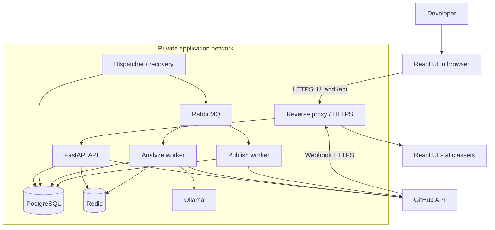
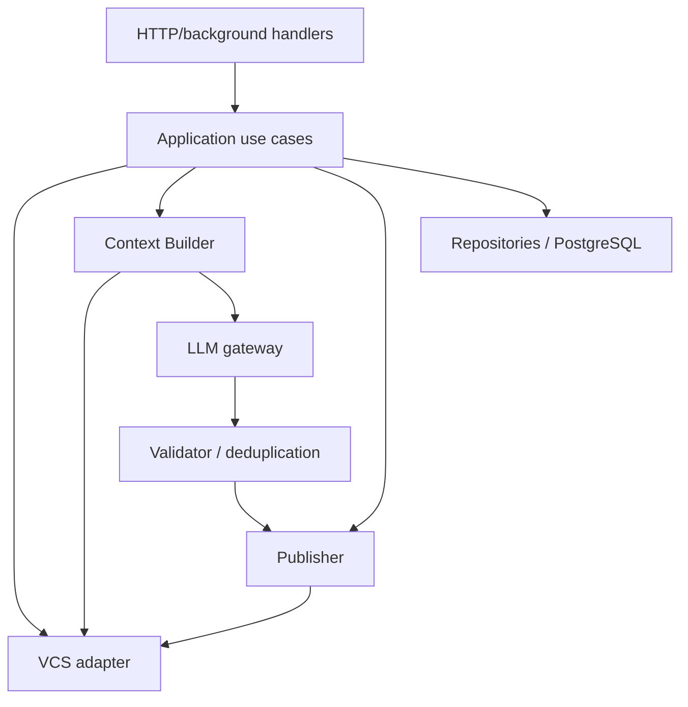
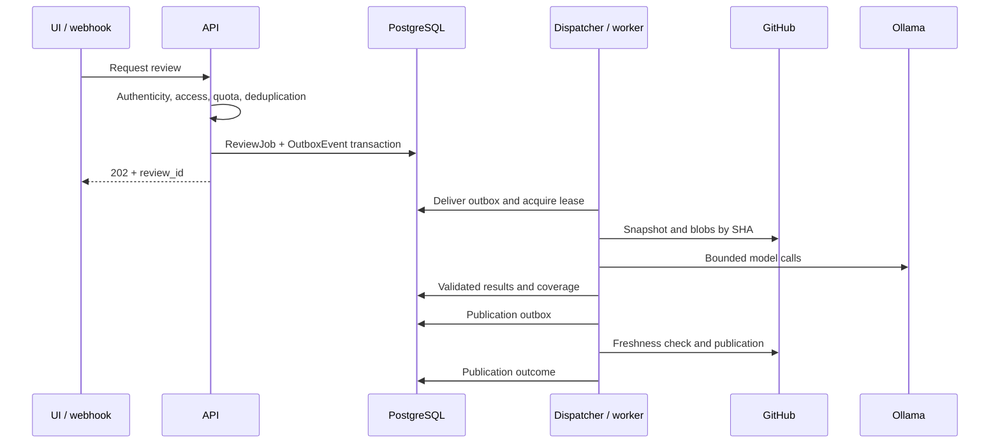
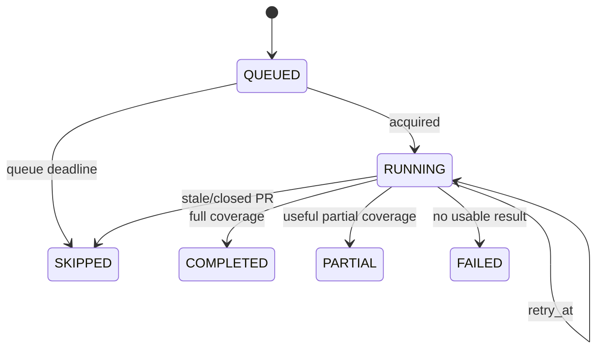
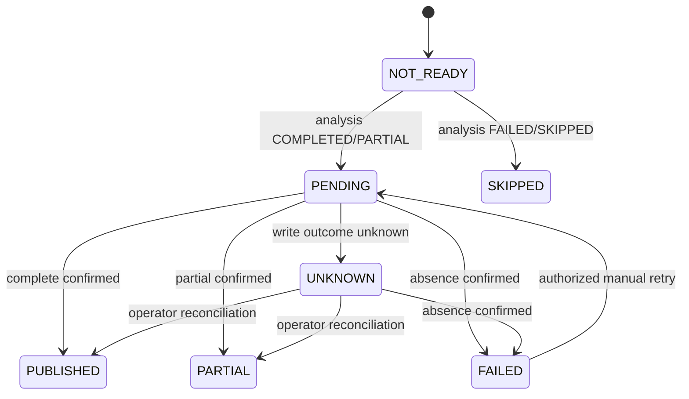
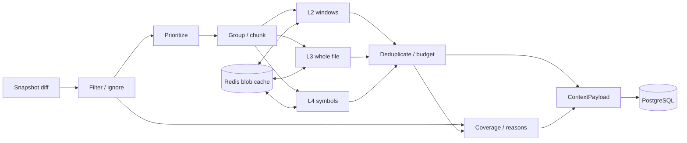
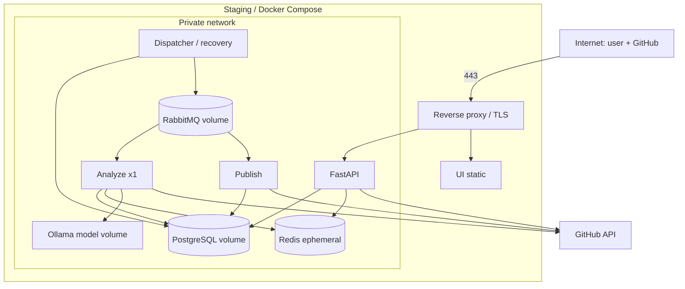

# AI Code Reviewer — System Design

Team 2 · Larchanka · Tech Lead: Narek Meliksetyan  
Version: 1.2 · September 13, 2026 · Status: pending team approval

## 1. Purpose and decision status

This document defines the AI code reviewer architecture and the contracts between frontend, backend, background processing, VCS integrations, and the LLM. Detailed module, UI, and test design belongs in the team's specialized documents.

- **Requirement** — explicitly follows from the assignment or recorded team materials.
- **v1 decision** — a proposal selected here to form a coherent MVP; it becomes an implementation contract after team approval.
- **Open question** — requires external confirmation or a team decision and is listed in section 16.

Unless stated otherwise, concrete limits and MVP restrictions are v1 decisions. The Definition of Done also requires this document to be committed and approved by the team.

## 2. Goals, requirements, and scope

The system obtains PR/MR changes from a VCS, builds relevant context, uses an LLM to analyze security, correctness, performance, and maintainability, validates the response, and produces a summary and diff-linked findings. Context has four levels: Diff, Surrounding Context, Whole File, and AST / Imports. Cost/context limits, retries, caching, and clear status are required.

The team board proposes a GitHub bot and reviewer-assignment trigger, access/quota checks, JWT, RabbitMQ, network segmentation, React/TypeScript, FastAPI/Python, SQLAlchemy/PostgreSQL, and Ollama SDK. Redis was initially optional. The model and paid subscription mechanism are undecided.

### MVP boundary — v1 decision

| Included | Excluded without a separate decision |
|---|---|
| GitHub PRs; adapter contract can support GitLab | Both VCS implementations at once |
| Product UI launch; bot trigger after feasibility validation | Every-push launch, quick actions, arbitrary mentions |
| Access and technical quota checks | Payments, billing, token purchases |
| PR summary/inline findings; runs, diff, results in UI | Full GitLab-like UI and agent chat |
| Python and TypeScript/TSX AST context | Full-repository indexing, external RAG, every language |
| Reading code and publishing comments | Running PR code, changing branches, auto-merge, applying fixes |
| Run continues independently of UI session | User cancellation of an accepted run |

Text recommendations are sufficient; applicable suggestions are optional. Reviews are advisory and do not replace tests, linters, SAST, or human approval.

### Current implementation

This is the **target MVP**, not a claim that all components exist. Baseline is each repository's `main`.

| Area | In `main` | Still required |
|---|---|---|
| Backend | Python 3.14, FastAPI, async SQLAlchemy/asyncpg, Alembic, PostgreSQL 18, Redis 8, structlog, Request ID, Docker | Domain/API, GitHub App/OAuth/webhook, Celery/RabbitMQ, dispatcher/outbox/workers, Context Builder, Ollama gateway, Publisher |
| Frontend | Minimal Vite + React + TypeScript | Auth, repository/PR selection, launch/history, progress/coverage, diff/findings, API client/state |
| Delivery | API CI, immutable GHCR image, manual VPS staging deploy | UI deploy, HTTPS proxy, private API, workers/RabbitMQ/Ollama, backup/restore, metrics |

Backend baseline: [`f7ae81e`](https://github.com/larchanka-training/dmc-268-api-t2/commit/f7ae81e6a510baf53c11bb802f51d04ce12406af). Frontend baseline: [`e222857`](https://github.com/larchanka-training/dmc-268-ui-t2/commit/e22285784c26715f11c22b652baadd9776819c15).

## 3. Architecture and responsibilities



| Component | Responsibility | Excludes |
|---|---|---|
| React UI | Repositories/PRs, launch, history, progress, diff, findings | Secrets, context construction, authorization decisions |
| FastAPI | Auth, webhooks, admission control, user API | Long review work in HTTP |
| Dispatcher/recovery | Outbox delivery, delayed retry, stale-task recovery, TTL cleanup | Code analysis |
| Celery workers | Analyze orchestration and separate publication | Queue as source of state |
| PostgreSQL | Runs, results, settings/access, outbox, leases, quotas, saved context | Permanent source retention |
| Redis | Rate limiting and hot TTL context/blob cache | Jobs, results, quotas, idempotency, correctness locks |
| RabbitMQ | Small acknowledged background tasks | Full diff, prompt, result |
| Ollama | Inference | VCS, DB, or secret access |

All backend processes share one project/image and domain model; they are not microservices. PostgreSQL is the result backend. Redis is required for v1 admission but contains no irreplaceable domain state; stored results remain readable when it is down.



The application layer controls sequencing. Repositories only persist. Adapters hide provider APIs. The gateway owns prompts, serialization, limits, and timeouts, but not publication policy. Context construction is deterministic and bounded; v1 has no autonomous tool loop.

## 4. Main flow and lifecycle



Job/quota creation is atomic and HTTP never waits for the model. Worker revalidates access, fixes the requested SHA snapshot, builds four context levels/chunks, validates model output, and saves completed chunks independently. Analysis and publication are separate: publication failure never repeats inference.

`ReviewJob.status`: `QUEUED → RUNNING → COMPLETED | PARTIAL | FAILED | SKIPPED`. `COMPLETED` means all eligible scoped changes were processed; `PARTIAL` has useful but incomplete coverage; `FAILED` has no usable result or required diff; `SKIPPED` did not run due to stale/closed PR, no eligible changes, or queue timeout. Policy exclusions appear in coverage but do not cause `PARTIAL`.

`stage`: `snapshot`, `context`, `inference`, `validation`, `done`. Progress is completed/planned chunks. Retryable failure stays `RUNNING` with `retry_at`.

`publication_status`: `NOT_READY`, `PENDING`, `PUBLISHED`, `PARTIAL`, `FAILED`, `UNKNOWN`, `SKIPPED`, independent of analysis.





`UNKNOWN` stops automatic retries until operator reconciliation. Transitions, reasons, and fencing tokens are recorded. Duplicate delivery continues the same run; explicit rerun creates a new run with `rerun_of`. A push alone does not launch proposed v1.

## 5. VCS integration and immutable snapshot

GitHub uses a GitHub App limited to selected repositories, with metadata/contents read and pull-request read/write permissions. `POST /api/v1/webhooks/github` verifies the raw-body signature and deduplicates by delivery ID. Unknown events return 2xx without creating jobs. The `pull_request/review_requested` bot scenario must be tested.

| Adapter operation | Input | Output / guarantee |
|---|---|---|
| Get PR | repository, number | State, title/body, author, source/base repositories/refs/SHA |
| Get diff snapshot | PR, fixed SHA | Files, hunks, line map, completeness |
| Read blob/tree | repository, SHA, path | Exact-version content within limit |
| Get discussions | PR, cursor | IDs, author, body, coordinates, commit |
| Publish/reconcile | Snapshot, validated result, marker | Remote IDs, typed error, or unknown outcome |

`Snapshot` contains repository IDs, `base_sha`, `merge_base_sha`, `head_sha`, `captured_at`, and provider diff version. Review covers `merge_base_sha…head_sha`; all reads use SHA, never branch names.

For fork PRs, metadata/files/patch come through the base repository and head is resolved as `refs/pull/{number}/head`. Direct source access requires installation permission. If a full blob is unavailable, level 1 may remain while levels 2–4 are marked unavailable; without a trustworthy diff the run fails. Private-fork support requires an integration test.

Pagination is mandatory. Missing/truncated patches are reconstructed from fixed blobs within limits or reported incomplete. Current-state APIs are SHA-checked before/after. Publication rechecks open state, head/base SHA, app access, and initiator rights; stale results remain in history but are not published.

| Domain | GitHub v1 | Future GitLab |
|---|---|---|
| Change request | PR number | MR IID |
| Discussion | reviews/comments | discussions/notes |
| Diff version | base/merge-base/head | base/start/head |
| Inline location | commit, path, side/line | position with three SHA, old/new path/line |
| Summary | COMMENT review body | note/discussion with same marker |

Provider-specific coordinates live in snapshot/publication metadata. GitLab implementation is outside v1.

## 6. Context Builder

`ContextPayload` is a versioned one-chunk package with `schema_version`, review/chunk IDs, snapshot, metadata, files, related symbols, coverage, and budget. Ranges are inclusive and 1-based; missing sides are `null`; paths are normalized.

| Level | Structure | Rule |
|---|---|---|
| Diff | `FileDiff` paths/status/blob SHA/language/hunks; hunk line kind/text/old/new line | Required exact line map |
| Surrounding | `SourceWindow` path/side/SHA/range/text/hunk IDs | ±30 default; merged overlaps; prefer bounded function |
| Whole File | path/side/SHA/text/changed ranges | New file ≤300 lines; old for deletion; budgeted |
| AST / Imports | symbol/name/kind/signature/path/SHA/range/relation/excerpt | Python/TS, depth 1, ≤20 symbols and 10 files |

Canonical schemas belong in backend `schemas/context/v1.json` and `schemas/review-result/v1.json`. Required v1 types include integer schema version, string opaque IDs/SHA/paths, nonempty `files`, diff status enum, line kind enum, `OLD/NEW` side, nullable required `whole_file`, 1-based ranges, and `full/degraded/diff_only` coverage. Skipped reasons are `policy`, `unsupported_language`, `unavailable_blob`, `provider_truncated`, `token_budget`, `file_limit`, `line_limit`, `context_error`.

```json
{
  "schema_version": 1,
  "review_id": "rev_01",
  "chunk_id": "chunk_001",
  "snapshot": {"provider": "github", "base_sha": "base-sha", "merge_base_sha": "merge-sha", "head_sha": "head-sha"},
  "metadata": {"title": "Validate payload", "body": null, "rules_version": "rules-v3", "output_language": "ru"},
  "files": [{
    "diff": {"old_path": "src/review.py", "new_path": "src/review.py", "status": "modified", "hunks": [{
      "hunk_id": "h1", "old_start": 38, "old_count": 1, "new_start": 38, "new_count": 2,
      "lines": [
        {"kind": "context", "text": "def validate(data):", "old_line": 38, "new_line": 38},
        {"kind": "added", "text": "    return Schema.model_validate(data)", "old_line": null, "new_line": 39}
      ]
    }]},
    "source_windows": [{"path": "src/review.py", "side": "NEW", "commit_sha": "head-sha", "start_line": 20, "end_line": 55, "text": "...", "covered_hunk_ids": ["h1"]}],
    "whole_file": {"path": "src/review.py", "side": "NEW", "commit_sha": "head-sha", "text": "...", "changed_ranges": [{"start_line": 39, "end_line": 39}]}
  }],
  "related_symbols": [{"qualified_name": "schemas.Schema", "kind": "class", "signature": "class Schema(BaseModel)", "path": "src/schemas.py", "commit_sha": "head-sha", "range": {"start_line": 10, "end_line": 24}, "relation": "import"}],
  "coverage": {"included": [{"path": "src/review.py", "ranges": [{"start_line": 39, "end_line": 39}]}], "skipped": [], "context_quality": "full"},
  "budget": {"estimated_input_tokens": 4200, "reserved_output_tokens": 2000, "limit_input_tokens": 10000}
}
```

Frontend receives API projections, not prompt payloads. Tree-sitter parses Python/TS; a resolver handles local Python and relative TS imports. Unresolved/dynamic/external symbols are marked, never invented.



Default policy excludes binaries, known lock files, minified/generated output, `dist/**`, `vendor/**`, snapshots, protobuf-generated files, and recognized generated headers. Migrations remain eligible. Admin-managed policy/overrides are versioned and frozen in each run. Priority is executable code, configuration, documentation. `surrounding_lines=30` is configurable and part of snapshot/cache key.

Small files may share a stable-order chunk. Large blocks split by hunk/range without losing line maps. Reserve instructions, diff, local context, and output before whole-file/symbol context; deduplicate levels 2–4. Budget exhaustion removes low-priority context, moves changes to later chunks, then reports partial coverage. No silent truncation.

Redis caches blobs/derived context by provider, installation/repository, SHA, path, builder/parser/window/rules versions, and relevant metadata hash. PostgreSQL stores final payloads and is authoritative. Authorization is checked on hits; negative VCS results cache ≤1 minute. LLM results are reused only to resume the same run. Redis uses TTL/eviction and can be cleared; outage returns 503 for new reviews but not stored-result reads.

## 7. LLM contract and validation

Gateway receives payload, model/version, prompt version, generation settings, and limits; it returns structured `ReviewChunkResult` with summary, findings, limitations, usage, and latency. Raw provider responses never reach frontend.

Gateway supplies the result JSON Schema through Ollama `format`, uses temperature 0, then performs independent schema/domain validation. Exact model/digest must pass structured-output testing. Schema validity does not prove truth.

Versioned prompts live in backend `.agents/reviewer/` with a manifest and SHA-256 hashes. Trusted repository rules are immutable PostgreSQL versions. Job creation stores exact prompt/rule digests and snapshots; retries never adopt a deployment update. Prompts are not returned or operationally logged.

Finding contract: exact path/`OLD|NEW` line/range; category `security|correctness|performance|maintainability`; severity `critical|high|medium|low`; concise title/explanation, supplied-context evidence, concrete recommendation. Validator enforces enums, sizes, snapshot paths, and changed-line coordinates. Unpublishable inline locations remain in UI/summary. Unverifiable findings are rejected; exact duplicates merge, semantic guesses do not. One format-repair call per run is allowed. Backend assigns IDs/fingerprints and builds final summary without a mandatory extra LLM call.

## 8. Publication

v1 creates one GitHub `COMMENT` review per run, with summary and ≤20 inline findings. Remaining findings stay in UI. Output language is Russian (`ru`) and is frozen in run configuration; code/paths/IDs are not translated. Bot never approves or requests changes.

```markdown
<!-- larchanka-ai-review:review_id=rev_01;head_sha=<sha>;schema=1 -->
## AI code review

Snapshot: `<head_sha>` · Coverage: `<reviewed>/<eligible>` · Status: `<COMPLETED|PARTIAL>`

<Summary and severity counts>

Limitations: <none or reasons>
[Open saved result](<review_url>)
```

Marker must be the first fully parsed body line; PR text is never a marker. Publisher leases the PR, checks freshness, searches by marker/app author, and stores remote IDs. Publication retry does not rerun inference.

There is no cross-system exactly-once transaction. After timeout, reconcile remote state. Unknown outcome becomes `UNKNOWN` and stops automatic resend; confirmed partial is `PARTIAL` and is not auto-completed. Retry requires confirmed total absence. Human comments are never changed. Missing findings in later nondeterministic reviews do not mean fixed.

## 9. Queue, idempotency, and recovery

Webhook deduplicates provider+delivery; manual launch requires scoped `Idempotency-Key`, request hash, and 24-hour TTL. Same request returns the prior ID, changed body returns 409. Only one active repository+PR+head+config run exists. Job/quota/outbox creation is transactional. Queue payload contains only schema/event/review IDs, `analyze|publish`, attempt, trace ID. Lease uses owner, expiry, increasing fencing token.

```json
{"schema_version": 1, "event_id": "evt_01", "review_id": "rev_01", "task_kind": "analyze", "attempt": 1, "trace_id": "req_01"}
```

Celery receives this JSON object as `kwargs.payload`; pickle is forbidden. v1 ignores unknown optional fields. Breaking field changes require a new major version/consumer. Unknown versions/tasks or invalid types enter safe `review.dead`.

| Parameter | v1 |
|---|---|
| Exchange/routing | durable direct `reviews`; keys/queues `review.analyze`, `review.publish`, `review.dead` |
| Delivery | persistent, publisher confirms, manual late ack after durable decision |
| Size/TTL | JSON ≤16 KiB; large data by review ID; message expiry 20 minutes |
| Consumers | analyze prefetch/concurrency 1; publish prefetch/concurrency 4 |
| Quarantine | explicit safe diagnostic envelope; operator replay only |

Dispatcher locks outbox rows. Duplicates are expected and guarded by stage/lease. Recovery recreates delivery when no live lease/progress exists. Application/dispatcher exclusively owns retry; no Celery autoretry. Recovery runs every 30 seconds, never retries before `retry_at`, but terminally closes expired jobs. Retry requires expired/no lease, reached retry time, remaining deadline/budget. Heartbeat 15 seconds, lease 90 seconds. Lost-lease workers cannot save or start external writes.

At most three transient attempts per stage use backoff/jitter/Retry-After. The whole deployment has one inference through one analyze worker. Horizontal scaling first requires a PostgreSQL lease/semaphore. PostgreSQL reserves durable quotas/active work; Redis only protects entry rates.

## 10. Data and retention

Core entities: User/RepositoryAccess; versioned Repository settings; mutable ChangeRequest; immutable ReviewJob snapshot/status/config; ContextPayload/ChunkResult; ReviewEvent; Finding; Publication; OutboxEvent/TaskLease; WebhookReceipt/IdempotencyRecord; QuotaUsage. Typed columns hold IDs, states, relationships, and constraints; versioned context/coverage/provider metadata may use JSONB.

Quota units are hourly `starts` scoped by user+repository and repository `active_jobs`; retries do not charge again. Reservation/release are idempotent. Alembic owns migrations. Job settings never change mid-run.

Retention: Redis ≤24h and 1 GiB/instance; source/context in PostgreSQL 7 days; results/evidence/events 30 days; result backups ≤7 days. After context deletion UI retains findings/metadata and reports unavailable diff. Redis/source are not long-term backups. Repository owners approve values.

## 11. Frontend ↔ backend API

JSON API prefix is `/api/v1`; OpenAPI is authoritative. Access is checked on every resource.

| Route | Purpose |
|---|---|
| GET auth start/callback; POST logout; GET me | OAuth/JWT session and capabilities |
| GET repositories and repository PRs | Accessible connected resources |
| GET/PUT repository settings | Versioned rules/ignores/quotas/language; admin; `If-Match`, 409 conflict |
| POST PR reviews | Requested head, optional rerun, idempotency; 202 + resource URL |
| GET review list/detail/findings/diff/events | History, snapshot/progress/coverage/results; diff 410 after retention |
| POST publication retries | Only eligible confirmed-absent `FAILED`; 409 otherwise |
| POST webhooks/github | Signed, deduplicated integration entry; no user JWT |

Routes are relative to `/api/v1`; deployment probes `/healthcheck` and `/readiness` are intentionally outside it. Lists use cursor pagination (20 default, 100 max), UTC ISO 8601, opaque IDs. Errors include safe code/message/request ID/retryability. UI polls 3 seconds with backoff to 15, pauses when hidden, and stops at terminal states. On 401 it stops, repeats OAuth with a safe return URL, and returns to the same review; background work continues.

## 12. Security

- GitHub OAuth through backend, then 30-minute Secure/HttpOnly/SameSite=Lax JWT cookie; no localStorage or refresh in MVP. Validate OAuth state, CSRF, and Origin.
- Local repository role plus current GitHub read-access check cached ≤60 seconds. Reviewer launches; admin changes settings. Fail closed. Encrypt user token backend-side.
- Installation token is never sent to UI or treated as user authorization. Revoked installation blocks work/publication.
- Deployment supplies minimal GitHub/JWT/webhook secrets; never commit or log them; rotate keys.
- PR code/descriptions/comments are untrusted data and cannot change system instructions. Model gets no shell, arbitrary network, or VCS tools; code/dependencies never execute/install.
- Validate/escape output and paths; mask discovered secrets. External LLM requires repository-owner approval.

## 13. Failures and observability

Database admission failure returns 503. Redis outage rejects new launches but permits stored reads. Broker outage leaves DB/outbox queued. VCS rate limits/5xx use bounded Retry-After; access/missing-resource errors are classified and never replaced with empty context. AST errors degrade coverage; LLM errors preserve completed chunks; worker death expires lease; changed PR blocks publication; unknown external writes enter `UNKNOWN`.

Structured logs include time, component, request/trace/review IDs, stage, attempt, duration, safe error code, transitions, cache metrics, counts, retries, and publication outcome—never raw prompt/code/reasoning. Measure API latency, queue age, stage durations, failure/partial rates, VCS/LLM errors, usage, cache, unknown publications. `/healthcheck` is dependency-free liveness. `/readiness` reports capabilities; synchronize backend `CONTEXT.md`.

## 14. Non-functional limits

| Parameter | Initial v1 value |
|---|---|
| Webhook / API | webhook p95 ≤1s; DB reads p95 ≤500ms |
| Analysis target | p95 ≤60s for ≤300 changed lines, acquisition to saved validated result; excludes queue/publication |
| Deadlines | queue ≤15m; analysis ≤10m including retry; publication cycle ≤5m |
| Admission | ≤20 nonterminal/repository; ≤10 starts/hour/user/repository |
| Change/source | ≤50 files, 2,000 changed lines; ≤1 MiB/blob, 10 MiB/run, whole file ≤300 lines |
| Model | window ≥16,384; call input ≤10k/output ≤2k; ≤5 chunks, ≤8 calls, ≤80k/16k total tokens |
| Timeouts/publication | VCS 15s; Ollama 120s; ≤20 inline findings |
| Concurrency | one inference deployment-wide; publication serialized per PR |

These are independent configurable ceilings, not guaranteed full coverage or an obligation to use every call. Remaining deadline wins. Benchmarks record model/quantization/digest, hardware/VRAM/RAM, warm/cold state, input/output, and load; 60s is a target until measured.

Golden-dataset gates: published Precision ≥85%, Critical Recall ≥75%, Hallucination Rate <3%, validated/published schema compliance 100%. QA covers Python/TS, all categories, clean PRs, false-positive traps, incomplete context, adequate critical cases, and reruns per model/prompt/rules version. No HA is promised. MVP uses one deployment, daily PostgreSQL backup, RPO ≤24h, manual restore, infrastructure-dependent RTO.

## 15. Deployment and ownership

Target v1 uses Docker Compose locally and on Hetzner staging. Reverse proxy terminates HTTPS and is the only public port. PostgreSQL/RabbitMQ have volumes, Redis is ephemeral, Ollama has a model volume. Terraform records or documents network/DNS/firewall. Port 8000 exposure is bootstrap only.



Alembic migrations run once before the new version. Deploy drains workers or lets lease recovery resume. Image/model digests are fixed; environment secrets are separate.

| Owner | Artifact |
|---|---|
| Narek, Tech Lead | `docs/SYSTEM_DESIGN.md`, cross-component contracts |
| Kirill | BACKEND_ARCHITECTURE.md, modules, ERD/migrations, use cases |
| Sasha | Python/uv baseline, quality, Docker/healthcheck |
| Lyosha / Dima | FRONTEND_ARCHITECTURE.md, UI/API types/state, React baseline |
| Stas H. | Versioned prompts/rules and `.agents` assets |
| Stas P. | TEST_PLAN.md, integration/recovery/e2e/LLM evaluation |
| Slava | Hetzner, Terraform, network, secrets, release, restore |

Canonical English design is `docs/SYSTEM_DESIGN.md`; `docs/SYSTEM_DESIGN_RU.md` preserves the Russian version. The API repository links here rather than maintaining a divergent copy.

## 16. Open questions

| Question | Default / blocked work | Approver |
|---|---|---|
| GitHub sufficient for MVP? | GitHub only; confirmation before GitLab adapter | Team / assignment owner |
| Can bot be requested as reviewer? | Test App/account/event; UI launch is reliable default | Tech Lead + backend |
| Meaning of subscription/token limit? | Enabled access and technical quotas only | Assignment owner + Tech Lead |
| OAuth/access policy? | Approve login/token check/local roles/installation owner | Tech Lead + backend + DevOps |
| Ollama model/hardware? | Need digest, ≥16K, structured output, latency measurement | Agentic + DevOps + QA |
| Retention/single host acceptable? | Approve retention, operator access, recovery goals | Repository owners + DevOps |

Open questions allow approval with documented defaults and block only their corresponding implementation. Update this file and TEAM_PROJECT.md after decisions.

## 17. Approval

Reviewers approve GitHub-first scope/UI, component boundaries and stores/queues, immutable snapshot and four context levels, finding/publication contract, limits/quality/retention/deployment, ownership, and open questions. Required reviewers: Tech Lead, backend architecture, frontend architecture, Agentic Engineer, QA, DevOps. Public API, state, queue/context, security, and NFR changes resolve before approval. After approvals, Tech Lead marks Approved with date and SHA.

## 18. Sources and precedence

1. Original team assignment and Tech Lead role.
2. TEAM_PROJECT.md dated September 7, 2026; repository status there is historical.
3. [Team 2 sprint board](https://www.tldraw.com/f/qdH9mHB7ezqaShpUBGvQC?d=v-5902.-1570.13006.7243.A2-cyhhZUcbI7713I8z93); newer explicit decisions win.
4. SYSTEM_DESIGN-Team-3.md for selected snapshot/adapter/recovery/publication ideas only.
5. gtilabduo-example.html as one observed example, not a GitLab Duo specification.

Unverified claims about GitLab internals, universal ignore files, exact context windows, or zero-data-retention are not implementation facts. Verify external APIs against official documentation.
